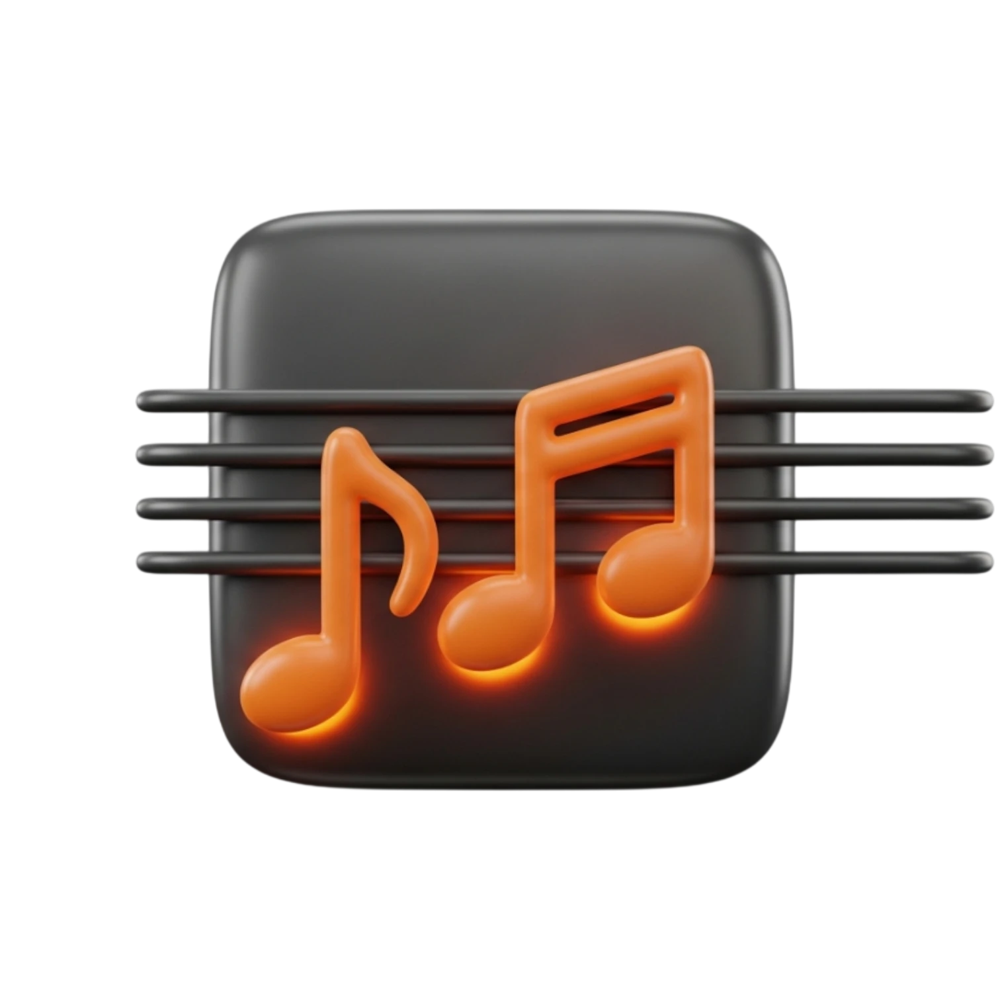

<div align="center">
  
</div>

# 🎹 Chord Trainer

**Jazz Piano Voicing Speed Trainer** — Drill chord voicings across all 12 keys with MIDI recognition, smart progressions, and progress tracking.

> Built for jazz piano students who want to build muscle memory for voicings — fast, focused, and measurable.

**Live:** [jazzchords.app](https://jazzchords.app) · **Status:** v0.5.0

---

## What It Does

Chord Trainer shows you chord symbols one at a time. You play them on your piano (MIDI or visual reference), hit next, and track your speed. The goal: make every voicing in every key automatic.

### Core Features

- **16 chord types** — Maj7, 7, m7, m7b5, dim7, 6, m6, 9, m9, Maj9, 6/9, Maj7#11, 7#9, 7b9, m11, 13
- **9 voicing types** — Root Position, Shell, Half-Shell, Full, Rootless A (Bill Evans), Rootless B, 1st/2nd/3rd Inversion
- **4 progression modes** — Random, ii-V-I (all 12 keys), Cycle of 4ths, I-vi-ii-V Turnaround
- **Custom Progressions** — Parse any chord sequence (Autumn Leaves, All of Me, etc.), loop with metronome
- **MIDI input** — Real-time chord recognition with lenient matching (octave-tolerant, extensions allowed)
- **Audio playback** — Hear every chord via Tone.js synth, toggle on/off
- **Metronome** — 40–240 BPM, accent on beat 1, visual beat indicator
- **Progress tracking** — Session history, streaks, weak chord analysis, improvement trends
- **9 practice plans** — One-tap presets from Warm-Up to Challenge mode
- **3 notation systems** — International, German (H/B), Symbol (Δ7, -7, ø7)
- **3 difficulty levels** — Beginner (5 types), Intermediate (9), Advanced (14+)

### For Educators

Chord Trainer can be white-labeled and embedded into education platforms.

→ [For Educators](https://jazzchords.app/for-educators)

---

## Tech Stack

| Layer | Tech | Version |
|-------|------|---------|
| Framework | SvelteKit | 2.52+ |
| UI | Svelte 5 | Runes syntax (`$state`, `$derived`, `$props`) |
| Styling | Tailwind CSS 4 | CSS-native config, no `tailwind.config.js` |
| Audio | Tone.js | 15.x (PolySynth + Metronome) |
| MIDI | Web MIDI API | Native (Chrome/Edge desktop) |
| Build | Vite | 6.x |
| Deploy | Vercel | adapter-vercel |
| Data | localStorage | Sessions, settings, streaks |

---

## Getting Started

```bash
# Prerequisites: Node.js 18+, pnpm
pnpm install
pnpm dev          # → http://localhost:5173
```

### Available Scripts

| Script | Purpose |
|--------|---------|
| `pnpm dev` | Start dev server |
| `pnpm build` | Production build |
| `pnpm preview` | Preview production build |
| `pnpm check` | TypeScript + Svelte type checking |

---

## Project Structure

```
src/
├── lib/
│   ├── engine/              ← Pure TypeScript (no DOM, no framework)
│   │   ├── notes.ts         ← Note arrays, enharmonics, German notation
│   │   ├── chords.ts        ← 16 chord types, intervals, difficulty pools
│   │   ├── voicings.ts      ← 9 voicing calculations
│   │   ├── keyboard.ts      ← 2-octave keyboard geometry
│   │   ├── progressions.ts  ← ii-V-I, Cycle of 4ths, I-vi-ii-V generators
│   │   ├── plans.ts         ← 9 practice plans, suggestion logic
│   │   ├── custom-progressions.ts ← Parser, evaluator, 7 jazz presets
│   │   └── index.ts         ← Barrel exports
│   ├── services/            ← Side effects, external APIs
│   │   ├── audio.ts         ← Tone.js synth + metronome
│   │   ├── midi.ts          ← Web MIDI API wrapper, chord matching
│   │   ├── progress.ts      ← localStorage history, streaks, analytics
│   │   └── theme.ts         ← Theme system
│   ├── components/          ← Svelte 5 components (9 total)
│   └── utils/
│       └── format.ts        ← Shared formatting utilities
├── routes/
│   ├── +page.svelte         ← Landing page (jazzchords.app)
│   ├── train/+page.svelte   ← Main training app (state machine)
│   ├── for-educators/       ← B2B landing page
│   ├── open-studio/         ← Platform integration demo
│   ├── about/               ← Company info
│   ├── privacy/             ← Privacy policy
│   └── impressum/           ← Legal notice (German)
└── app.css                  ← Design tokens, Tailwind, theme variables
```

---

## Documentation

| Document | What's in it |
|----------|-------------|
| [docs/PROJECT.md](docs/PROJECT.md) | Roadmap, changelog, version history |
| [docs/ARCHITECTURE.md](docs/ARCHITECTURE.md) | Technical deep-dive: engine, services, data flow |
| [docs/FEATURES.md](docs/FEATURES.md) | Complete feature inventory (marketing-safe) |
| [docs/OPEN_QUESTIONS.md](docs/OPEN_QUESTIONS.md) | Known issues, tech debt, inconsistencies |
| [docs/BUSINESS.md](docs/BUSINESS.md) | Business plan, monetization, Go-to-Market |
| [docs/MUSIC_THEORY.md](docs/MUSIC_THEORY.md) | Music theory reference for developers |
| [docs/DECISIONS.md](docs/DECISIONS.md) | Architecture decision log (ADR) |
| [docs/CONTRIBUTING.md](docs/CONTRIBUTING.md) | Code conventions, dev workflow |

---

## Browser Support

| Browser | MIDI | Audio | Training |
|---------|------|-------|----------|
| Chrome (Desktop) | ✅ | ✅ | ✅ |
| Edge (Desktop) | ✅ | ✅ | ✅ |
| Firefox | ❌ | ✅ | ✅ (no MIDI) |
| Safari | ❌ | ✅ | ✅ (no MIDI) |
| Mobile (any) | ❌ | ✅ | ✅ (tap instead of Space) |

> MIDI requires the Web MIDI API, currently only supported in Chromium-based desktop browsers.

---

## License

[MIT](LICENSE)

---

<div align="center">
  
  <br>
  <sub>Built by <a href="https://jazzchords.app/about">Aaron Technologies OÜ</a> · © 2026</sub>
</div>
